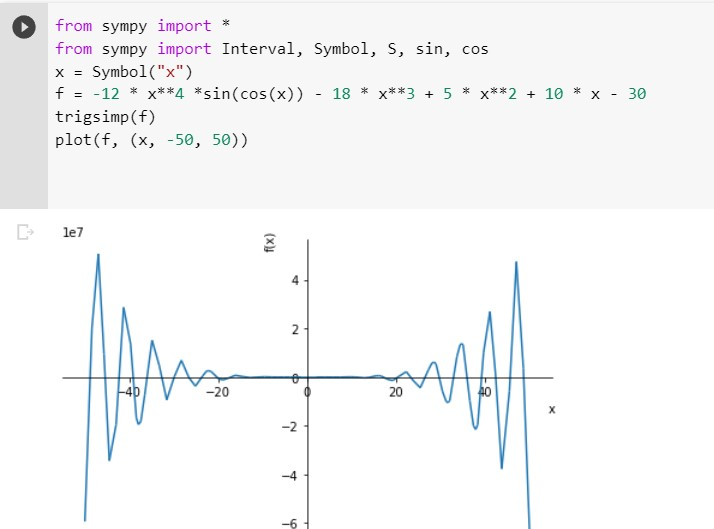

## *Практическое задание к 11 семинару.* ##
**Задача**\
f(x) = -12x^4*sin(cos(x)) - 18x^3+5x^2 + 10x - 30

1. Определить корни.
2. Найти интервалы, на которых функция возрастает.
3. Найти интервалы, на которых функция убывает.
4. Построить график.
5. Вычислить вершину.
6. Определить промежутки, на котором f > 0.
7. Определить промежутки, на котором f < 0.

**Решение**

*1. Определить корни.*\
Данная тригонометрическая функция имеет множество корней. Все корни определить невозможно, так как sin и cos - функции переодические и повторяют свои значения через определённые промежутки бесконечное множество раз вне зависимости от добавления аргументов.

*2. Найти интервалы, на которых функция возрастает.*\
Так как функция имеет бесконечное множество корней, функция будет возрастать на бесконечном множестве интервалов, каждый интервал нужно будет рассматривать отдельно.

*3. Найти интервалы, на которых функция убывает.*\
Так как функция имеет бесконечное множество корней, функция будет убывать на бесконечном множестве интервалов, каждый интервал нужно будет рассматривать отдельно.

*4. Построить график.*\
При построении графика (код в файле z1.py) я пробовала разные интервалы и (-5;5), и (-20;20), и (-100;100), и (-300;300). Так как функция имеет бесконечное множество корней, можно подставлять любые границы для построения графика. Остановилась на (-50;50).

*5. Вычислить вершину.*\
Так как функция бесконечна и имеет множество корней, она также имеет бесконечное множество вершин.

*6. Определить промежутки, на котором f > 0.*\
Промежутков, на котором f > 0, бесконечное множество. Каждый промежуток нужно будет рассматривать отдельно.

*7. Определить промежутки, на котором f < 0.*\
Промежутков, на котором f < 0, бесконечное множество. Каждый промежуток нужно будет рассматривать отдельно.
