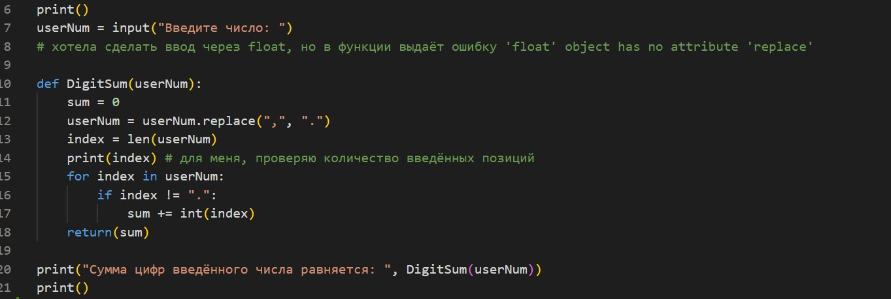
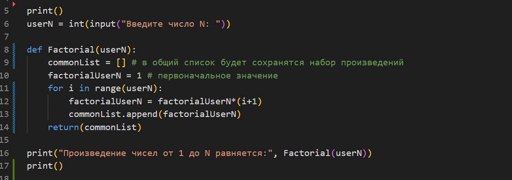
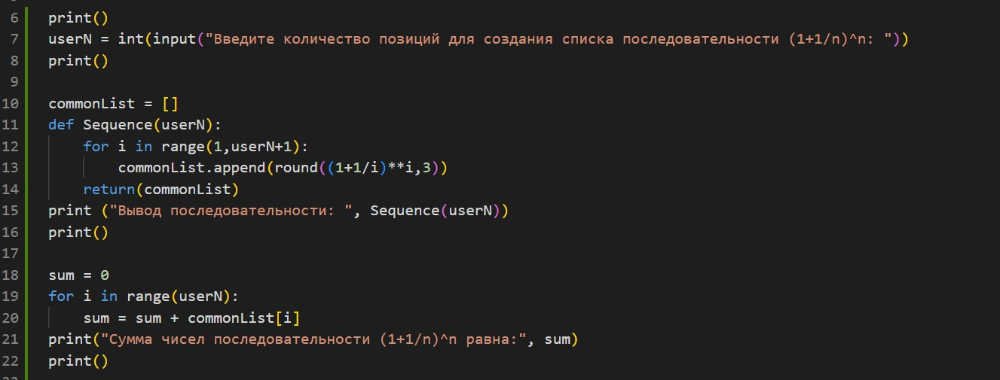
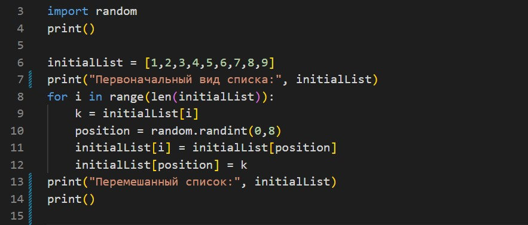

# *Знакомство с Python* #
## ***Домашняя работа №2*** ##

*Задача 1*

Напишите программу, которая принимает на вход вещественное число и показывает сумму его цифр.   

Пример:    
6782 -> 23
0,56 -> 11

Решение:

*Задача 2*

Напишите программу, которая принимает на вход число N и выдает набор произведений чисел от 1 до N.    

Пример:    
N = 4 =>[ 1, 2, 6, 24 ] (1, 1 * 2, 1 * 2 * 3, 1 * 2 * 3 * 4)

Решение:

*Задача 3*

Задайте список из n чисел последовательности (1+ 1/n)^n и выведите на экран их сумму (округляйте до 3 знаков после запятой).    

Пример:    
для n = 6: [2, 2.25, 2.37, 2.441, 2.488, 2.522]

Решение:

*Задача 4*

Задайте список из N элементов, заполненных числами из промежутка [-N, N]. Найдите произведение элементов на указанных позициях. Позиции хранятся в файле file.txt в одной строке одно число.

Решение:

*Задача 5*

Реализуйте алгоритм перемешивания списка.

Решение:

