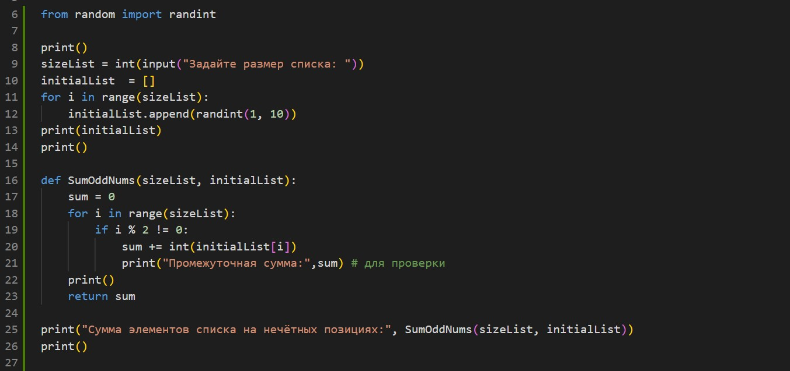
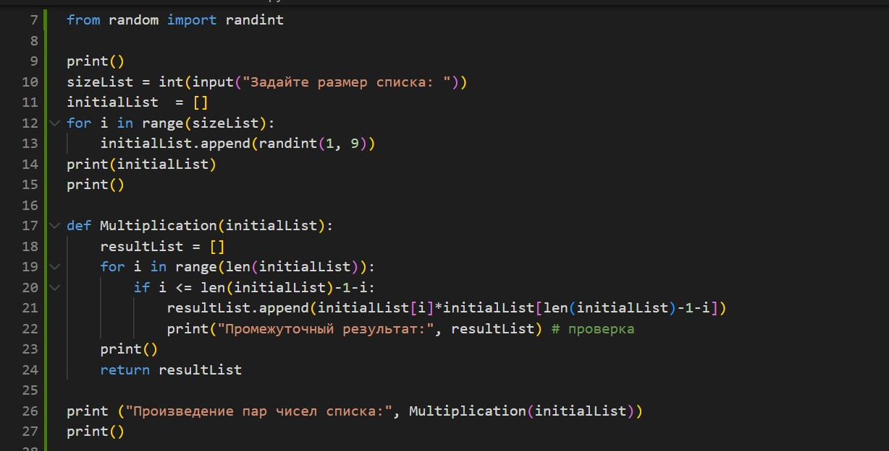
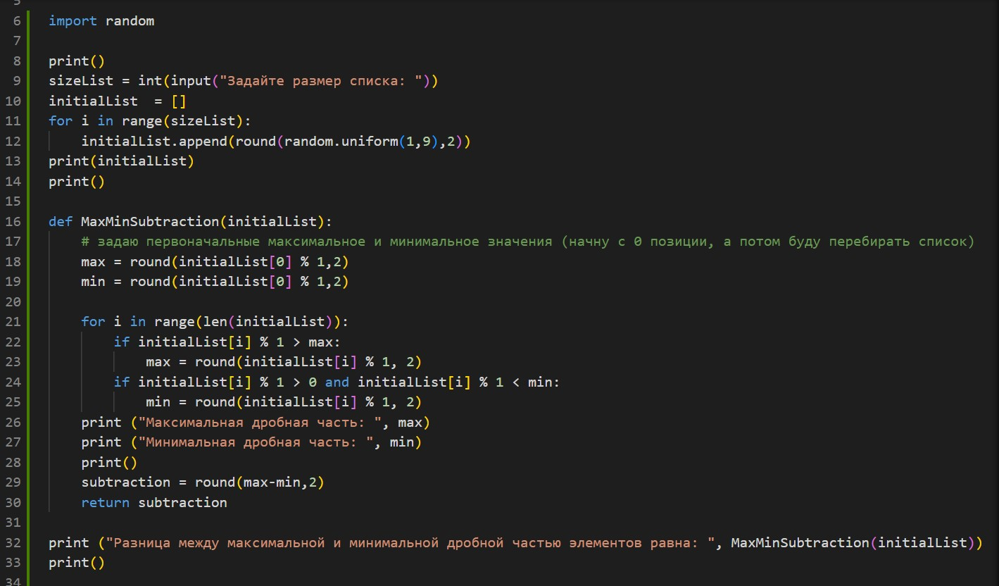
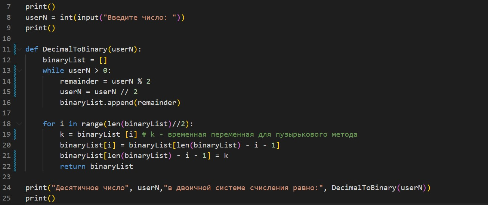
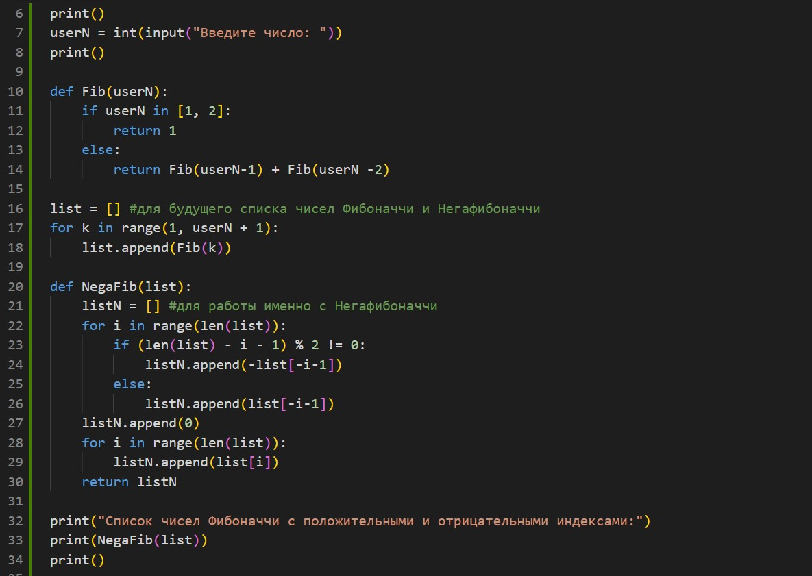

# *Знакомство с Python* #
## ***Домашняя работа №3*** ##

*Задача 1*

Задайте список из нескольких чисел. Напишите программу, которая найдёт сумму элементов списка, стоящих на нечётной позиции. 

Пример:    

[2, 3, 5, 9, 3] -> на нечётных позициях элементы 3 и 9, ответ: 12

Решение:

*Задача 2*

Напишите программу, которая найдёт произведение пар чисел списка. 
Парой считаем первый и последний элемент, второй и предпоследний и т.д.    

Пример:    

[2, 3, 4, 5, 6] => [12, 15, 16]

[2, 3, 5, 6] => [12, 15]

Решение:

*Задача 3*

Задайте список из вещественных чисел. 
Напишите программу, которая найдёт разницу между максимальным и минимальным значением дробной части элементов.  

Пример:    

[1.1, 1.2, 3.1, 5, 10.01] => 0.19

Решение:

*Задача 4*

Напишите программу, которая будет преобразовывать десятичное число в двоичное.    

Пример:    

45 -> 101101

3 -> 11

2 -> 10

Решение:

*Задача 5*

Задайте число. Составьте список чисел Фибоначчи, в том числе для отрицательных индексов.    

Пример:    

для k = 8 список будет выглядеть так: [-21 ,13, -8, 5, −3, 2, −1, 1, 0, 1, 1, 2, 3, 5, 8, 13, 21] 

Решение:

