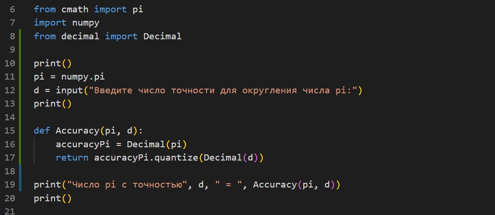

# *Знакомство с Python* #
## ***Домашняя работа №4*** ##

*Задача 1*

Вычислить число c заданной точностью d.

Пример:

при d = 0.001, π = 3.141    10^(-1) ≤ d ≤10^(-10)

Решение:

*Задача 2*

Задайте натуральное число N.
Напишите программу, которая составит список простых множителей числа N.

Решение:

*Задача 3*

Задайте последовательность чисел. Напишите программу,
которая выведет список неповторяющихся элементов исходной последовательности.

Решение:

*Задача 4*

Задана натуральная степень k. Сформировать случайным образом список коэффициентов
(значения от 0 до 100) многочлена и записать в файл многочлен степени k.

Пример:

k=2 => 2*x^2 + 4*x + 5 = 0 или x^2 + 5 = 0 или 10*x^2 = 0

Решение:

*Задача 5*

Даны два файла, в каждом из которых находится запись многочлена. 
Задача - сформировать файл, содержащий сумму многочленов.

Решение:

